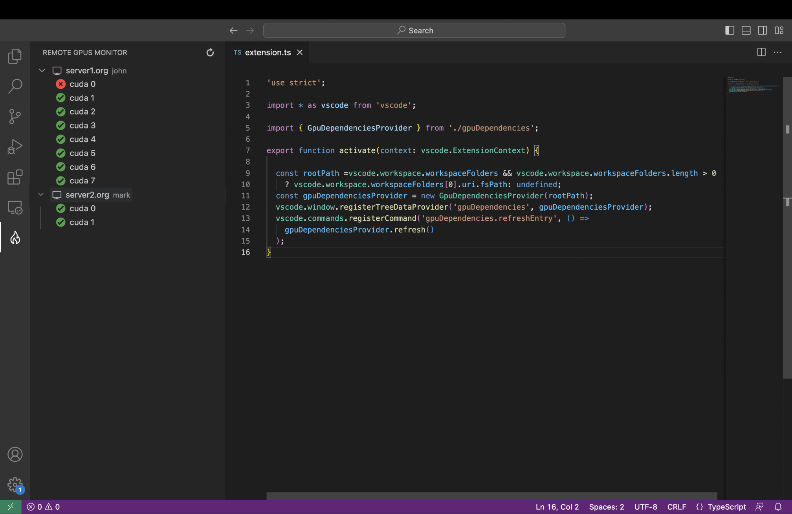

# Remote GPUs Monitor
<p align="center">

</p>
Remote GPUs Monitor is a Visual Studio Code extension designed to help monitor GPUs on remote servers. It enables users to easily keep track of GPU utilization and availability on remote servers right from within the familiar environment of Visual Studio Code.




## Features

- Monitor GPUs on remote servers
- Display GPU usage and availability
- Automatic login via SSH key
- User-friendly interface within Visual Studio Code

## Installation

1. Launch Visual Studio Code.
2. Go to the Extensions view by clicking on the square icon in the sidebar on the left or pressing `Ctrl+Shift+X` (`Cmd+Shift+X` on macOS).
3. Search for "Remote GPUs Monitor" and click on the **Install** button.

## Usage

1. Once installed, go to the Remote GPUs Monitor tab in Visual Studio Code.
2. To open the settings, click on the gear icon in the lower-left corner of the extension tab and then click on **Settings**.
3. In the search field at the top of the settings page, type "Remote GPUs Monitor" to filter the settings specifically for this extension.
4. In the search results, click on "Remote GPUs Monitor" to access the extension settings.
5. In the settings, you can insert multiple username, server, and key file combinations using the following format:

```
<user>@<server>, /path/to/key
<user>@<server>, /path/to/key
```

For example:

```
john@remote-server1, /home/john/.ssh/id_rsa
jane@remote-server2, /path/to/another/key
```

Each combination should be entered on a separate line.

4. Save the settings file.

5. The extension will display a list of servers and their associated GPUs.

6. Each GPU will be marked with a red cross if a process is currently using it or a green check if it is available.

7. Monitor the GPU usage and availability in real-time.

Note: Make sure that the SSH keys provided have the necessary permissions set to allow automatic login to the remote servers.

## Contributing

We welcome contributions from the community to make the Remote GPUs Monitor extension even better. To contribute, follow these steps:

1. Fork the repository on GitHub.
2. Clone the forked repository to your local machine.
3. Make your desired changes and improvements.
4. Commit and push your changes to your forked repository.
5. Submit a pull request on the main repository.

We appreciate your contributions and will review your pull request as soon as possible.

## License

Remote GPUs Monitor is licensed under the [MIT License](LICENSE).

---

This README was generated using ChatGPT.

We hope you find the Remote GPUs Monitor extension useful! If you encounter any issues or have suggestions for improvements, please feel free to report them on the [issue tracker](https://github.com/your-username/remote-gpus-monitor/issues).

Happy monitoring!
